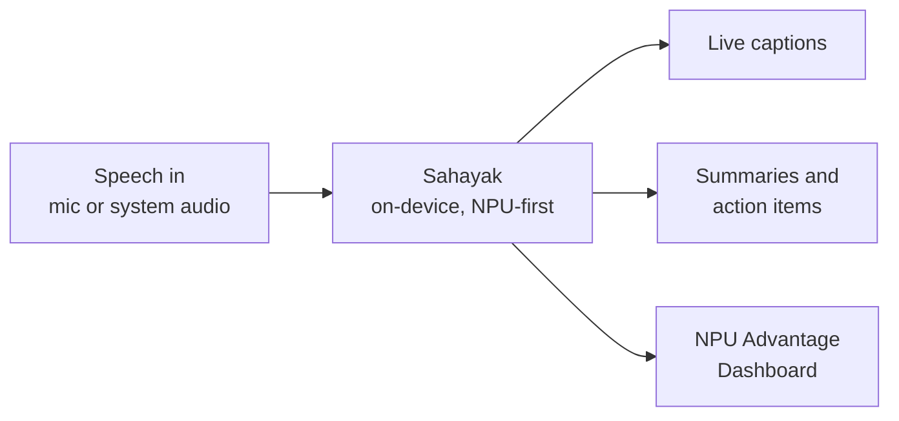
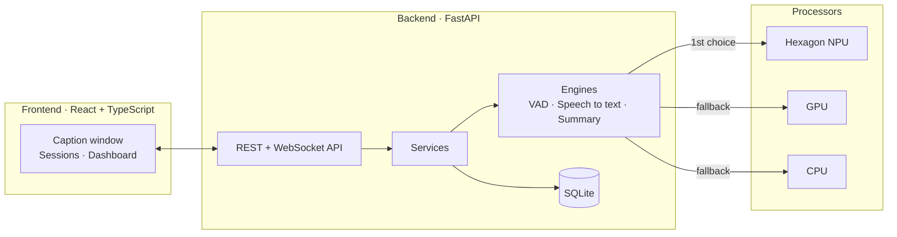

# Hexacode · Sahayak

**Every lecture. Every language. On your laptop.**

An offline, NPU-first meeting and classroom copilot for Snapdragon-powered HP PCs. It turns live speech in English, Hindi and Hinglish into captions and summaries, keeps all audio on the device, and includes a dashboard that measures what the Snapdragon NPU actually saves.

> **Status: proposal submitted, baseline in development.**
> This repository holds the project proposal and the code as it is built. Files are added step by step. The [Project Status](#project-status) table shows exactly what is done, so nothing here is claimed before it works.

Submitted to the **Snapdragon AI Lab Build and Present Challenge** by **Syed Amaan Hasan** (M.Tech AI/ML, BITS Pilani).

---

## Table of Contents

1. [The Problem](#the-problem)
2. [The Solution](#the-solution)
3. [How Sahayak Differs from Windows Live Captions](#how-sahayak-differs-from-windows-live-captions)
4. [Features](#features)
5. [Architecture](#architecture)
6. [NPU Advantage Dashboard](#npu-advantage-dashboard)
7. [Tech Stack](#tech-stack)
8. [Project Structure](#project-structure)
9. [Getting Started](#getting-started)
10. [Running on a Snapdragon PC](#running-on-a-snapdragon-pc)
11. [Project Status](#project-status)
12. [Roadmap](#roadmap)
13. [Honesty Policy](#honesty-policy)
14. [Documentation](#documentation)
15. [Contributing](#contributing)
16. [Author](#author)
17. [License](#license)

---

## The Problem

**For users**

- Cloud note-taking tools need a stable internet connection, often a subscription, and permission to upload audio. This shuts out many students, clinics, small offices and government departments, especially where connectivity is weak.
- Most tools handle Indian languages poorly, and code-mixed speech (Hindi and English in one sentence, called Hinglish) even worse.

**For Snapdragon**

- Snapdragon X laptops offer a 45 TOPS NPU, but few everyday apps give a user a visible reason to care.
- Developers find it hard to confirm that their app really runs on the NPU and not on the CPU, and to show what that saves in battery.

## The Solution

Sahayak listens to any lecture, meeting or call and gives you live captions, summaries and action items. It runs on the Snapdragon NPU first, works with no internet, and never uploads your audio. A built-in dashboard shows measured proof of the speed and battery benefit.



## How Sahayak Differs from Windows Live Captions

Windows already offers offline live captions on supported Snapdragon PCs. Sahayak does not try to replace it. It adds:

| Sahayak adds | Why it matters |
|---|---|
| Hindi and Hinglish focus | Built and tested for the way many classrooms and offices actually speak |
| Saved sessions and offline summaries | Notes and action items after every session, with no cloud |
| Proof dashboard | A repeatable test showing which processor ran each stage and what it cost |
| Meeting Q&A *(stretch goal)* | Ask questions about past sessions, on the device |

## Features

**Core (the baseline focus)**

- Live English, Hindi and Hinglish captions from the microphone
- Caption window with adjustable text size and a high-contrast theme
- Saved sessions with timestamped transcripts
- Local summaries: key points and action items
- NPU Advantage Dashboard comparing NPU, CPU and GPU on the same audio

**Stretch goals (only after the core is stable)**

- Live translation between English, Hindi and other Indian languages
- Ask-your-meeting Q&A over saved transcripts
- Read-aloud of summaries for low-vision users

## Architecture



**Pipeline:** audio capture → voice activity detection → speech recognition → summarizer → captions and notes.

| Stage | Model direction | Runtime | Planned processor |
|---|---|---|---|
| Voice activity detection | Silero VAD | ONNX Runtime | CPU |
| Speech recognition | Whisper family (Qualcomm AI Hub) | ONNX Runtime with QNN | NPU first |
| Summarization | Small on-device LLM, or an extractive fallback | ONNX Runtime GenAI or Qualcomm Genie | NPU first |
| Translation *(stretch)* | AI4Bharat IndicTrans2, distilled | ONNX Runtime | NPU where supported |

**Fallback chain:** NPU → GPU → CPU. The app records which processor ran every stage, so it is always clear where the work happened. Stages such as voice detection and the interface run on the CPU by design.

> Every model is checked against Qualcomm AI Hub and the target device before use. Models that do not compile or run are replaced or moved to the CPU, and this is documented openly.

## NPU Advantage Dashboard

The dashboard turns "the NPU helps" into measured results that anyone can repeat.

| Measure | How it is measured | Compared across |
|---|---|---|
| Caption delay | Time from the end of a speech segment to the caption appearing, from in-app logs | NPU, CPU, GPU (if supported) |
| Real-time factor | Processing time divided by audio length, on the same audio file | NPU, CPU, GPU (if supported) |
| Processor use | Windows performance counters and the Task Manager NPU graph | NPU vs CPU load |
| Battery drain | Discharge rate over a fixed run from the same starting charge, with the same brightness and background apps | NPU vs CPU-only |
| Accuracy | Word error rate on a small English, Hindi and Hinglish test set | Per language |

Goals: caption delay of about 2 seconds or less, lower power draw on the NPU than the CPU, and more battery life per hour than a CPU-only run. **These are goals until measured.** Results will be published here with the method and raw data.

## Tech Stack

| Layer | Choice |
|---|---|
| Backend | Python 3.11+, FastAPI, SQLAlchemy 2, Alembic, Pydantic v2 |
| Database | SQLite by default, PostgreSQL-ready through `DATABASE_URL` |
| ML runtime | ONNX Runtime (QNN execution provider), Qualcomm AI Hub, ONNX Runtime GenAI |
| Frontend | React 18, TypeScript, Vite, Tailwind CSS, React Query, Recharts |
| Quality | Ruff, mypy, pytest, ESLint, Prettier, Vitest, pre-commit |
| Delivery | Docker (CPU only), GitHub Actions CI, Windows ARM64 installer (planned) |

## Project Structure

Target layout. Folders appear as the baseline is built.

```text
Hexacode/
├── backend/          FastAPI app: api, services, repositories, db, engines, schemas
├── frontend/         React + TypeScript app
├── docs/             Proposal, architecture, API notes, Snapdragon setup
├── scripts/          Model download, seed data, benchmark audio helpers
├── .github/          CI workflows, issue and PR templates
├── Makefile          setup, dev, test, lint, format, migrate, build
├── docker-compose.yml
└── README.md
```

## Getting Started

> **Coming with the baseline.** The commands below are the target workflow and will work once the baseline is merged. Until then, see the [Project Status](#project-status) table.

```bash
git clone https://github.com/beckkenstschaft/Hexacode.git
cd Hexacode
make setup     # install backend and frontend dependencies
make migrate   # create the database
make dev       # start backend and frontend
```

The app must run on any machine with no models downloaded. In that mode it uses clearly labelled **simulated** engines, and the interface shows a "Simulated" badge. Real models are downloaded with `scripts/download_models.py`.

## Running on a Snapdragon PC

The NPU is only reachable from a **native Windows on ARM64** setup. Docker on other systems is CPU-only.

Steps to be verified on an HP Snapdragon X-series PC:

1. Install an ARM64-native Python and Node.js.
2. Install ONNX Runtime with the QNN execution provider.
3. Compile and profile the models with Qualcomm AI Hub, then download them with the model script.
4. Start the app and open the dashboard to confirm which processor each stage used.

Exact commands and tested hardware will be listed in `docs/snapdragon-setup.md` after on-device testing. The device model will be named there.

## Project Status

| Area | Status |
|---|---|
| Project proposal | Done, see `docs/` |
| Architecture plan | In progress |
| Backend: API, database, engines | Planned |
| Live captions (English, Hindi, Hinglish) | Planned |
| Summaries and action items | Planned |
| NPU Advantage Dashboard | Planned |
| Frontend | Planned |
| Tests and CI | Planned |
| Windows ARM64 installer | Planned |
| On-device Snapdragon benchmarks | Not started |

This table is updated with every milestone.

## Roadmap

| Phase | Goal |
|---|---|
| Days 1–3 | Set up the Snapdragon environment, run Whisper through AI Hub on the NPU, first profiling result |
| Days 4–7 | Voice detection, chunked processing, Hindi and Hinglish testing, caption window |
| Days 8–10 | Local summarizer |
| Days 11–13 | Dashboard and benchmark data on NPU, CPU and GPU |
| Days 14–16 | ARM64 installer, on-device tests, demo video |
| After the core | Translation, meeting Q&A, read-aloud |

If time is short, stretch goals are cut first. The dashboard is never cut.

## Honesty Policy

- No benchmark number is hard-coded. Every figure shown comes from a stored measurement.
- If the NPU or GPU is not available on a machine, the app says so and shows results only for processors that ran.
- Output from demo engines is always marked as simulated.
- Unverified steps are marked "to verify on device".

## Documentation

| File | Contents |
|---|---|
| `docs/proposal.docx` | Full project proposal |
| `docs/architecture.md` | Architecture and design decisions *(planned)* |
| `docs/api.md` | API reference *(planned)* |
| `docs/snapdragon-setup.md` | Setup and results on a Snapdragon PC *(planned)* |

## Contributing

Suggestions and issues are welcome. Please open an issue before a large change. Code should follow the project's linting rules, include tests, and keep comments short and useful.

## Author

**Syed Amaan Hasan**
M.Tech AI/ML, BITS Pilani

## License

See the `LICENSE` file in this repository.
