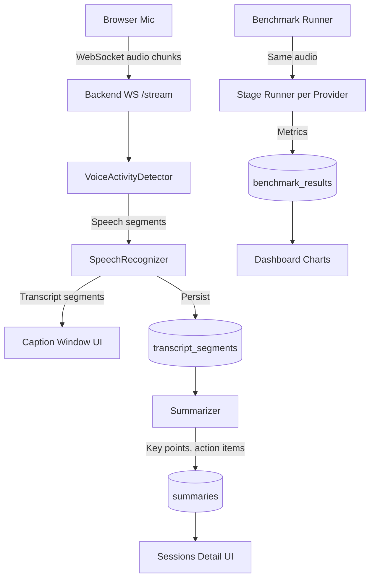
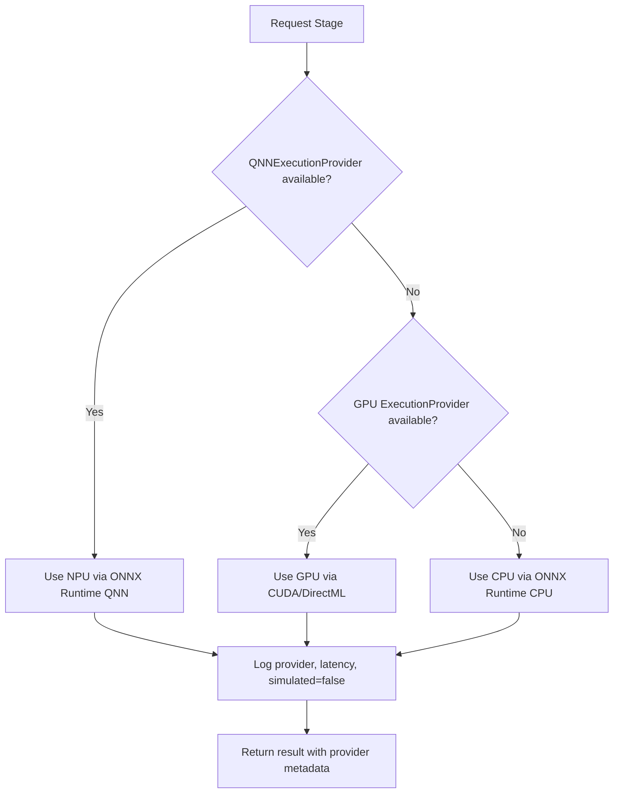

# Sahayak

[](https://github.com/your-org/Hexacode/actions/workflows/ci.yml)
[](https://opensource.org/licenses/MIT)
[](https://www.python.org/downloads/)
[](https://react.dev/)

**Offline, NPU-first meeting and classroom copilot for Snapdragon-powered HP PCs — with a built-in "NPU Advantage" proof dashboard**

## The Problem

Meetings and classrooms generate vast amounts of spoken content that's lost without manual note-taking. Existing solutions either:
- Require cloud connectivity (privacy concerns, latency, cost)
- Run slowly on CPU-only hardware
- Don't prove where acceleration actually happens

## Solution

Sahayak runs entirely offline on your Snapdragon-powered HP PC:
- **Live captions** in English, Hindi, and Hinglish via WebSocket streaming
- **Local summarization** with key points and action items
- **NPU Advantage Dashboard** — honest benchmarks comparing NPU, GPU, and CPU on the *same audio* with real measurements stored in a database

## Key Features

| Feature | Status | Notes |
|---------|--------|-------|
| Live captions (EN/HI/Hinglish) | ✅ Core | WebSocket streaming, VAD chunking |
| Session persistence | ✅ Core | Transcripts with timestamps & language |
| Extractive summarization | ✅ Core | Key points + action items |
| GenAI summarization (ONNX Runtime GenAI) | 🔧 Stretch | Behind feature flag |
| Translation | 🔧 Stretch | Not implemented |
| Meeting Q&A | 🔧 Stretch | Not implemented |
| Read-aloud (TTS) | 🔧 Stretch | Not implemented |
| NPU Advantage Dashboard | ✅ Core | Real measurements, honest empty states |

## Architecture



### Provider Selection (Honest & Transparent)



## Tech Stack

| Layer | Technology |
|-------|------------|
| Backend | Python 3.11+, FastAPI, SQLAlchemy 2.x, Alembic, Pydantic v2 |
| ML Runtime | ONNX Runtime (QNN, CUDA, DirectML, CPU) |
| Models | Silero VAD, Whisper tiny (ONNX), Extractive summarizer |
| Frontend | React 18, TypeScript, Vite, Tailwind CSS, TanStack Query, Recharts |
| Database | SQLite (dev), PostgreSQL (prod) via SQLAlchemy |
| Testing | pytest, Vitest, Testing Library |
| CI/CD | GitHub Actions, Docker multi-stage builds |

## Project Structure

```
Hexacode/
├── backend/
│   ├── app/
│   │   ├── api/v1/           # FastAPI routers
│   │   ├── core/             # Config, logging, errors, deps
│   │   ├── db/               # SQLAlchemy models, session
│   │   ├── engines/          # ML engine protocols & impls
│   │   ├── repositories/     # Data access layer
│   │   ├── schemas/          # Pydantic v2 schemas
│   │   └── services/         # Business logic
│   ├── tests/
│   ├── alembic/
│   ├── scripts/
│   └── pyproject.toml
├── frontend/
│   ├── src/
│   │   ├── api/              # Typed API client
│   │   ├── components/       # Reusable UI components
│   │   ├── hooks/            # Custom React hooks
│   │   ├── pages/            # Page components
│   │   └── styles/
│   └── package.json
├── docs/
│   ├── architecture.md
│   ├── api.md
│   └── snapdragon-setup.md
├── scripts/
├── .github/workflows/
├── docker-compose.yml
├── Makefile
└── README.md
```

## Quick Start (5 Commands)

```bash
# 1. Clone and enter repo
git clone https://github.com/your-org/Hexacode.git
cd Hexacode

# 2. Run setup (installs deps, creates venv, runs migrations)
make setup

# 3. Start development servers
make dev

# 4. Open http://localhost:5173 in browser

# 5. (Optional) Seed sample data
make seed
```

> **No models required** — runs in simulated mode by default with visible "Simulated" badges.

## Running on Snapdragon X Windows ARM64

> **📋 To verify on device** — NPU acceleration requires native Windows on ARM64 with Qualcomm Neural Processing SDK.

### Prerequisites
- Snapdragon X Elite/Plus HP PC
- Windows 11 24H2+ on ARM64
- Qualcomm Neural Processing SDK installed
- ONNX Runtime with QNNExecutionProvider

### Setup
```bash
# 1. Install Qualcomm Neural Processing SDK
# Download from Qualcomm Developer Network

# 2. Install ONNX Runtime with QNN
pip install onnxruntime-qnn  # or build from source

# 3. Configure backend/.env
USE_MOCK_ENGINES=false
PREFERRED_PROVIDERS=QNNExecutionProvider,CUDAExecutionProvider,DmlExecutionProvider,CPUExecutionProvider

# 4. Download/convert models for QNN
python scripts/download_models.py

# 5. Run benchmark to verify NPU
make dev
# Open Dashboard → Run Benchmark → Check NPU results
```

See [docs/snapdragon-setup.md](docs/snapdragon-setup.md) for detailed instructions.

## Configuration

All configuration via environment variables (see `backend/.env.example`):

| Variable | Default | Description |
|----------|---------|-------------|
| `PRODUCT_NAME` | Sahayak | Product name (single source of truth) |
| `ENVIRONMENT` | development | development\|testing\|production |
| `DATABASE_URL` | sqlite+aiosqlite:///./data/sahayak.db | Database connection |
| `USE_MOCK_ENGINES` | true | Use mock engines (no model downloads) |
| `VAD_MODEL_PATH` | models/silero_vad.onnx | VAD model path |
| `ASR_MODEL_PATH` | models/whisper_tiny.onnx | ASR model path |
| `PREFERRED_PROVIDERS` | QNN,CUDA,DML,CPU | Provider priority order |
| `CORS_ORIGINS` | localhost:5173 | Allowed CORS origins |
| `LOG_LEVEL` | INFO | Logging level |
| `LOG_FORMAT` | json | json\|console |

## API Overview

See [docs/api.md](docs/api.md) for full OpenAPI reference.

| Endpoint | Method | Description |
|----------|--------|-------------|
| `/health` | GET | Health check |
| `/ready` | GET | Readiness check |
| `/system/capabilities` | GET | Available providers, models, simulated mode |
| `/sessions` | POST | Create session |
| `/sessions` | GET | List sessions (paginated) |
| `/sessions/{id}` | GET | Get session with transcripts & summaries |
| `/sessions/{id}/stream` | WS | Live caption WebSocket |
| `/sessions/{id}/summary` | POST | Generate summary |
| `/benchmarks` | POST | Run benchmark |
| `/benchmarks` | GET | List benchmark runs |
| `/benchmarks/{id}` | GET | Get benchmark with results |

## Benchmark Methodology

The NPU Advantage Dashboard runs **honest benchmarks** on the same audio across all available processors:

### What We Measure
1. **Latency (ms)** — Wall-clock time per stage (VAD, ASR, Summarization)
2. **Real-Time Factor (RTF)** — `latency_ms / (audio_duration_s * 1000)`; < 1.0 = faster than real-time
3. **CPU Utilization (%)** — Average CPU during inference via `psutil`
4. **NPU Utilization (%)** — Estimated via QNN profiling (best effort)
5. **Battery Delta (%)** — Battery drain during benchmark via `psutil.sensors_battery()` (best effort)

### How It Works
```python
for provider in available_providers:
    for stage in ["vad", "asr", "summarization"]:
        cpu_before = psutil.cpu_percent()
        battery_before = get_battery()

        start = time.perf_counter()
        result = engine.run(audio)
        latency_ms = (time.perf_counter() - start) * 1000

        cpu_after = psutil.cpu_percent()
        battery_after = get_battery()

        save_result(provider, stage, latency_ms, rtf, cpu, npu, battery_delta)
```

### Honesty Guarantees
- ✅ Every number comes from a real measurement stored in the database
- ✅ NPU/GPU only appear if actually available (`QNNExecutionProvider` detection)
- ✅ Mock engine outputs flagged `simulated: true` in API + "Simulated" badge in UI
- ✅ Empty states shown when processor unavailable
- ✅ No hardcoded or fabricated numbers

### Limitations
- NPU % and battery Δ are best-effort estimates
- Requires physical Snapdragon device for accurate NPU measurements
- Thermal throttling affects sustained performance
- Background processes affect CPU/battery readings

## Testing

```bash
# Backend tests (with coverage)
make test-backend

# Frontend tests
make test-frontend

# All tests
make test

# Linting
make lint

# Format code
make format
```

### Coverage Targets
- Backend services: ≥80%
- Frontend components: Main flows covered

## Roadmap (Stretch Goals)

- [ ] **Translation** — EN ↔ HI ↔ Hinglish via local models
- [ ] **Meeting Q&A** — RAG over session transcripts
- [ ] **Read-aloud (TTS)** — Offline neural TTS (Piper/VITS)
- [ ] **Speaker diarization** — Distinguish speakers in meetings
- [ ] **Export formats** — PDF, Markdown, SRT, VTT
- [ ] **Mobile companion** — React Native app for remote viewing
- [ ] **Plugin system** — Custom summarizers, formatters

## Contributing

See [CONTRIBUTING.md](CONTRIBUTING.md) for guidelines.

1. Fork the repo
2. Create feature branch (`git checkout -b feat/amazing-feature`)
3. Commit changes (Conventional Commits)
4. Run tests and linters (`make test && make lint`)
5. Open Pull Request

## License

MIT License — see [LICENSE](LICENSE) for details.

## Acknowledgments

- [Silero VAD](https://github.com/snakers4/silero-vad) — Voice activity detection
- [Whisper](https://github.com/openai/whisper) — Speech recognition (ONNX conversion)
- [ONNX Runtime](https://onnxruntime.ai/) — Cross-platform ML inference
- [Qualcomm AI Hub](https://aihub.qualcomm.com/) — Model optimization for NPU
- [Tailwind CSS](https://tailwindcss.com/) — Utility-first styling
- [TanStack Query](https://tanstack.com/query) — Server state management
- [Recharts](https://recharts.org/) — Composable charting

---

**Built for Snapdragon-powered HP PCs • Runs offline • Honest benchmarks**