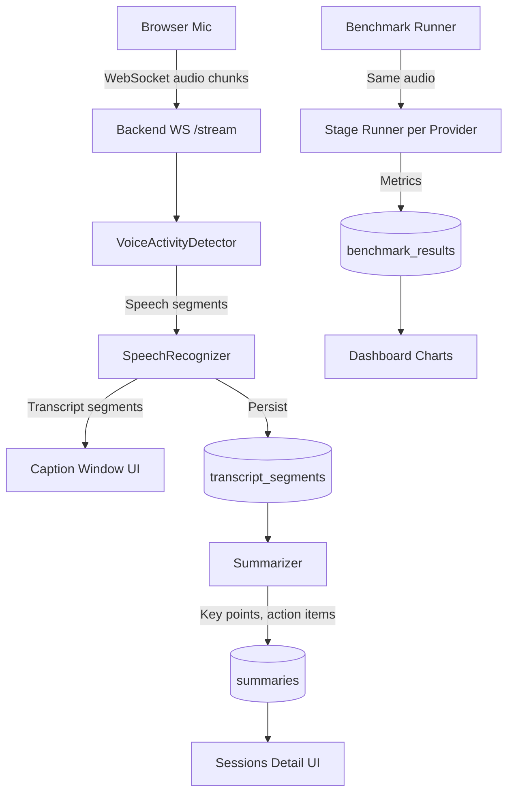
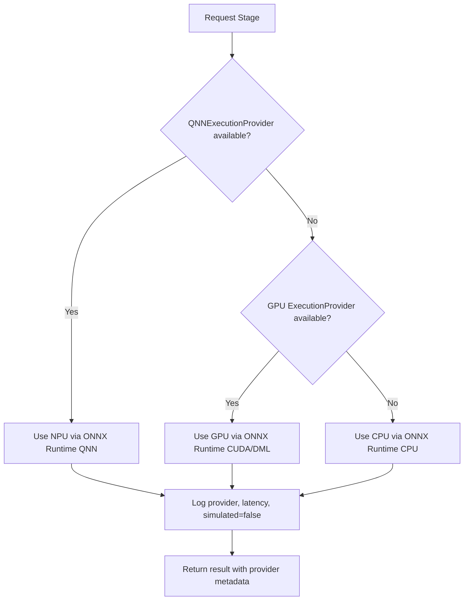
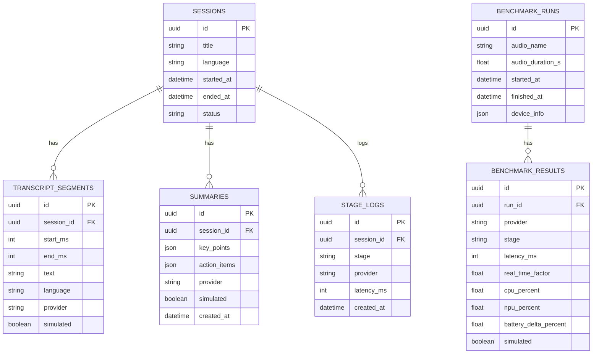

# Architecture Document

## Project Overview

**Product Name:** Sahayak (configurable in one place)
**Repo Name:** Hexacode
**Target:** Offline, NPU-first meeting/classroom copilot for Snapdragon-powered HP PCs

## Folder Structure

```
Hexacode/
├── backend/
│   ├── app/
│   │   ├── api/v1/           # FastAPI routers (versioned)
│   │   ├── core/             # Config, logging, errors, dependencies
│   │   ├── db/               # SQLAlchemy models, session
│   │   ├── engines/          # ML engine abstractions & implementations
│   │   ├── repositories/     # Data access layer
│   │   ├── schemas/          # Pydantic v2 schemas
│   │   ├── services/         # Business logic
│   │   └── main.py           # FastAPI app entry point
│   ├── tests/
│   ├── alembic/
│   ├── pyproject.toml
│   ├── Dockerfile
│   └── .env.example
├── frontend/
│   ├── src/
│   │   ├── api/              # Typed API client
│   │   ├── components/       # React components
│   │   ├── hooks/            # Custom hooks
│   │   ├── pages/            # Page components
│   │   ├── services/         # Business logic (no UI)
│ │   ├── styles/             # Tailwind config, global styles
│ │   ├── types/              # TypeScript types
│ │   ├── utils/              # Utilities
│ │   ├── App.tsx
│ │   └── main.tsx
│ ├── tests/
│ ├── package.json
│ ├── tsconfig.json
│ ├── vite.config.ts
│ ├── tailwind.config.js
│ ├── Dockerfile
│ └── .env.example
├── docs/
│   ├── architecture.md
│   ├── api.md
│   ├── snapdragon-setup.md
│   └── proposal.docx
├── scripts/
│   ├── download_models.py
│   ├── seed_data.py
│   └── benchmark_audio.py
├── .github/
│   ├── workflows/ci.yml
│   ├── PULL_REQUEST_TEMPLATE.md
│   └── ISSUE_TEMPLATE/
├── docker-compose.yml
├── Makefile
├── .gitignore
├── .editorconfig
├── LICENSE
├── CONTRIBUTING.md
├── CODE_OF_CONDUCT.md
├── SECURITY.md
├── CHANGELOG.md
└── README.md
```

## Technology Choices

### Backend
- **Python:** 3.11+
- **Framework:** FastAPI (async)
- **ORM:** SQLAlchemy 2.x (async)
- **Migrations:** Alembic
- **Validation:** Pydantic v2
- **Settings:** pydantic-settings
- **Logging:** structlog (JSON)
- **Testing:** pytest, pytest-asyncio, pytest-cov
- **Linting:** ruff, mypy (strict)
- **ML Runtime:** ONNX Runtime (with QNNExecutionProvider for NPU)
- **Models:** Silero VAD, Whisper ONNX (tiny/base), extractive summarizer, optional ONNX Runtime GenAI LLM

### Frontend
- **Framework:** React 18 + TypeScript + Vite
- **Styling:** Tailwind CSS
- **State/Data:** TanStack Query (React Query)
- **Charts:** Recharts
- **Testing:** Vitest, Testing Library
- **Linting:** ESLint, Prettier, TypeScript strict

### Infrastructure
- **Container:** Multi-stage Dockerfiles, docker-compose (dev, CPU-only)
- **CI:** GitHub Actions (lint, type-check, test, build)
- **Pre-commit:** Husky/lint-staged equivalents via pre-commit hooks

## Milestones

### Milestone 1: Backend Skeleton & Database
- [ ] Project structure, pyproject.toml, config (pydantic-settings)
- [ ] SQLAlchemy 2.x models, Alembic setup, migrations
- [ ] Database session management, repository pattern base
- [ ] Core: logging, errors, dependencies, health/ready endpoints
- [ ] `.env.example`, Dockerfile (multi-stage), docker-compose.yml

### Milestone 2: Engines & Provider Selection
- [ ] Engine protocols (VAD, ASR, Summarizer)
- [ ] Provider selector: QNN (NPU) -> GPU -> CPU
- [ ] Silero VAD ONNX implementation
- [ ] Whisper ONNX implementation
- [ ] Extractive summarizer + optional GenAI LLM adapter
- [ ] Mock implementations (flagged `simulated: true`)
- [ ] Model download script

### Milestone 3: REST & WebSocket APIs
- [ ] Sessions CRUD API
- [ ] WebSocket `/stream` for live captions
- [ ] Summary generation API
- [ ] System capabilities endpoint
- [ ] Benchmark API (run, list, get)
- [ ] Input validation, CORS, request IDs, pagination

### Milestone 4: Backend Tests
- [ ] Unit tests for services, engine selection, repositories
- [ ] API tests with test database
- [ ] WebSocket test
- [ ] Coverage >= 80% on services
- [ ] Lint/type-check passing

### Milestone 5: Frontend Core
- [ ] Vite + React + TS + Tailwind setup
- [ ] Typed API client (generated from OpenAPI or manual)
- [ ] React Query setup, error/loading states
- [ ] Layout, navigation, theme (Snapdragon blue #3253DC, navy #0B1A4F)
- [ ] Accessibility: keyboard nav, ARIA, WCAG AA contrast

### Milestone 6: Frontend Features
- [ ] Live page: mic start/stop, caption window, text size, high-contrast, language selector, provider badge, simulated badge
- [ ] Sessions list & detail page with transcript
- [ ] Summary generation action
- [ ] Dashboard: capabilities panel, run benchmark, charts (latency, RTF, battery), processor table, honest empty states
- [ ] Settings page

### Milestone 7: Frontend Tests & Polish
- [ ] Component tests for main flows
- [ ] E2E smoke test
- [ ] Lint/type-check passing

### Milestone 8: Tooling, CI, Docker
- [ ] Makefile with all targets
- [ ] GitHub Actions CI workflow
- [ ] Pre-commit hooks
- [ ] Dependabot config
- [ ] Docker multi-stage builds, non-root user
- [ ] Verify `docker compose up` works (CPU-only)

### Milestone 9: Documentation & README
- [ ] api.md (OpenAPI reference)
- [ ] snapdragon-setup.md (QNN, Qualcomm AI Hub - marked "to verify on device")
- [ ] Mermaid diagrams in architecture.md
- [ ] Professional README.md with all required sections
- [ ] CHANGELOG.md, CONTRIBUTING.md, CODE_OF_CONDUCT.md, SECURITY.md

### Milestone 10: Verification & Demo
- [ ] `make setup && make dev` works from clean checkout (simulated mode)
- [ ] Live session demo: captions -> saved -> summary
- [ ] Benchmark runs on CPU, stores real measurements
- [ ] NPU shows only if available
- [ ] All lint/test/build pass
- [ ] Alembic migrations apply cleanly

## Data Flow (Mermaid)



## Provider Selection Logic



## Database Schema



## Configuration (Single Source of Truth)

Product name lives in:
- Backend: `app/core/config.py` -> `settings.PRODUCT_NAME`
- Frontend: `src/utils/constants.ts` -> `PRODUCT_NAME`

Default: "Sahayak"

## Honesty Rules Enforcement

- All benchmark numbers from real measurements in DB
- NPU/GPU availability checked at runtime, reported in `/system/capabilities`
- Mock engines return `simulated: true` in API response
- UI shows "Simulated" badge when `simulated === true`
- README marks unverified Snapdragon steps as "to verify on device"